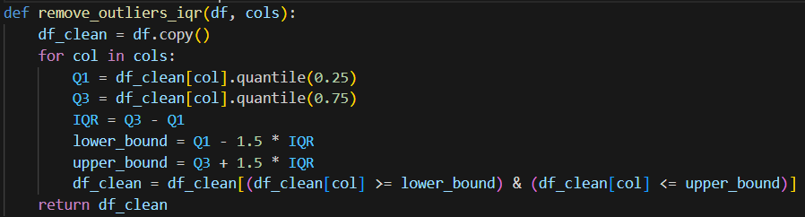
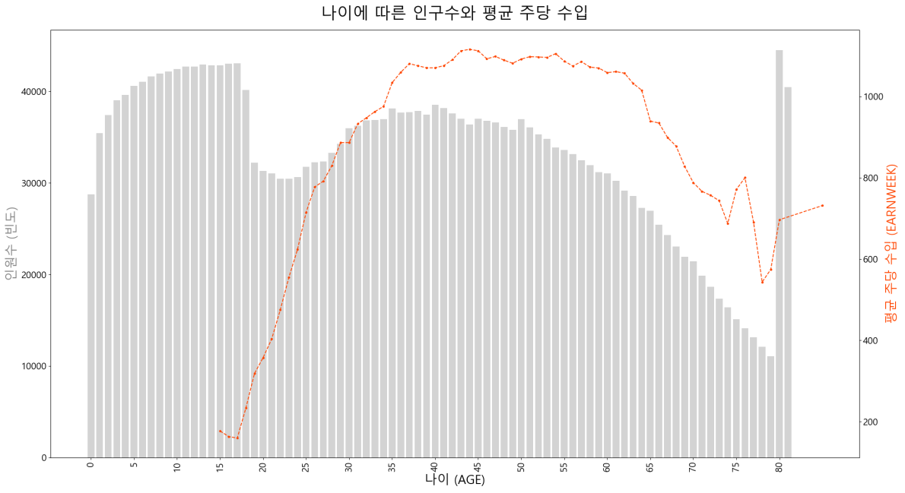

**SK네트웍스 Family AI 캠프 17기 2차 프로젝트**

---

# 1. 팀소개

###  ` ⭐️ 6조 Guardians of Health ⭐️ `

      
## 👥 팀 멤버 (개인 GitHub)
 
<table align="center">
  <tr>
    <td align="center" valign="top" style="padding: 10px;">
      <strong>김민균</strong> 
      
</td>
    <td align="center" valign="top" style="padding: 10px;">
      <strong>성기혁</strong> 
      
    </td>
    <td align="center" valign="top" style="padding: 1px;">
      <strong>이가은</strong> 
          
 
    </td>
    <td align="center" valign="top" style="padding: 800px;">
      <strong>이재은</strong> 
          
 
    </td>
    <td align="center" valign="top" style="padding: 500px;">
      <strong>홍문봉</strong> 
          
 
    </td>
  </tr>
  <tr>
    <td align="center"><a href="https://github.com/alswhitetiger">@alswhitetiger</a></td>
    <td align="center"><a href=https://github.com/venus241004>@venus241004</a></td>
    <td align="center"><a href=https://github.com/Leegaeune>@Leegaeune</a></td>
    <td align="center"><a href=https://github.com/JAEEUN0129>@JAEEUN0129</a></td>
    <td align="center"><a href=https://github.com/Glowcloudy>@Glowcloudy</a></td>
  </tr>
</table>

# 2. 프로젝트개요

## 💡 프로젝트 명

### ` 인공지능 기반 민간 건강보험 이탈 예측 프로젝트  `
 

## 🗓️ 프로젝트 기간

### 2025.08.12 ~ 2025.08.13

 

## 🌟 프로젝트 소개
#### 본 프로젝트는 미국 IPUMS CPS(Integrated Public Use Microdata Series, Current Population Survey) 데이터를 활용하여, 고객의 인구통계학적 정보(연령, 교육 수준, 결혼 여부, 고용 상태 등)와 경제적 지표(주당 소득, 노동시장 참여 여부, 군·공공·민간 보험 가입 여부)를 종합적으로 분석하여 민간 건강보험 이탈 여부를 예측하는 인공지능 모델을 개발하는 것을 목표로 합니다. 데이터 전처리 및 EDA 과정을 통해 유의미한 변수들을 추출하고, CatBoost, Logistic Regression, XGBoost, Elastic Net 등 다양한 머신러닝 알고리즘을 적용하여 성능을 비교·평가했습니다.
 
 

## 🚀 프로젝트 필요성(배경)
 #### 민간 건강보험 시장에서는 고객의 이탈을 사전에 예측하고 이를 방지하는 전략이 중요한 과제로 부각되고 있습니다. 특히 소득 변화, 직업 상태, 공공보험 가입 여부 등의 요인이 민간보험 유지 여부에 직접적인 영향을 미칠 수 있습니다. 본 프로젝트는 이러한 다양한 속성 데이터를 기반으로 고객의 이탈 가능성을 예측함으로써, 보험사들이 보다 효율적인 리텐션(고객 유지) 전략을 수립할 수 있도록 지원합니다.
 
 

## ✅ 프로젝트 목표

- 민간 건강보험 이탈 여부를 예측할 수 있는 인공지능 모델 개발

- 다양한 알고리즘(CatBoost, Logistic Regression, XGBoost, Elastic Net)의 성능 비교 및 최적 모델 선정

- 주요 영향 요인 분석을 통해 고객 이탈의 핵심 변수 도출

- 보험사 맞춤형 고객 관리 및 마케팅 전략 수립을 위한 데이터 기반 의사결정 지원

 

---

## 📦 데이터 출처 목록

| 데이터 이름                           | 파일 형식 / 수집 방법 | 출처 URL |
|--------------------------------------|------------------------|----------|
| IPUMS CPS     |     직접 다운로드 / CSV       | [바로가기](https://cps.ipums.org/cps/index.shtml) |

---

# 3. 기술스택

  
  
  
  
  
  
  
  

---

# 4. WBS

---
# 5. 데이터 전처리 결과서
## 데이터 전처리 과정

1. **데이터 로드**
   
   

   - 원본 데이터에서 필요한 컬럼만 선택 로드 (usecols 사용) -> 불필요한 변수는 초기에 제외하여 메모리 절약 및 분석 속도 향상
   - 주요 분석 컬럼(`YEAR`, `AGE`, `RACE`, `MARST`, `EDUC`, `EARNWEEK`, `PHINSUR` 등)만 추출
     
2. **범주형 변수 숫자 인코딩**
   
   
   
   - RACE, MARST, EMPSTAT를 코드형으로 변환하여 RACE_code, MARST_code, EMPSTAT_code 생성
   - 범주형 → 수치형 변환은 상관관계 분석, 모델 입력에 활용 가능

3. **결측치 및 이상치 탐색**
   
   
   
   - 컬럼별 결측치 개수 확인
   - 수치형 변수 기초 통계로 이상치 후보 파악

4. **IQR 기반 이상치 제거**
   
   
   
   - Q1, Q3 사분위수를 이용해 IQR 계산
   - 1.5 × IQR 기준 밖의 값은 이상치로 판단해 제거
   - 이상치 제거 전후 박스플롯 비교

5. **시각화(EDA)**
   - 상관관계 히트맵: 선택된 수치형 변수 간 상관 분석
   - Pairplot: AGE, NCHILD, ASECWT의 분포와 고용 상태별 관계 시각화
   - Boxplot, Barplot: 인종별/혼인 상태별 평균 나이 비교
     

  
  

  
  

  
  

---

# 6. 인공지능 학습 결과서

모델 : 
1. **XGBoost**   고객의 과거 및 현재 데이터를 비교하여 나이 변화나 소득 변화율과 같은 변화량 특징을 생성하고,
교육 수준(EDUC) 및 인종(RACE)과 같은 범주형 변수는 원-핫 인코딩이나 레이블 인코딩으로 처리->  
Optuna를 사용하여 XGBoost의 최적 하이퍼파라미터를 탐색하고, Stratified K-Fold 교차 검증 및 Early Stopping으로 모델의 성능을 검증한 뒤, 
이 과정을 통해 최적의 모델을 찾은 후, 전체 훈련 데이터로 최종 모델을 학습 ->  
마지막으로, ROC AUC와 같은 성능 지표를 사용하여 모델을 평가 그리고 모델, 사용된 파라미터, 그리고 특징 중요도와 같은 정보를 아티팩트(artifact)로 저장하여 나중에 재사용하거나 분석할 수 있도록 구성합니다  

2. **CatBoost**  고객의 과거·현재 데이터를 비교해 나이 변화, 소득 변화율 등 변화량 특징을 생성하고,
교육 수준(EDUC)·인종(RACE) 등 범주형 변수는 원-핫 인코딩 없이 CatBoost의 cat_features로 처리 ->   
Optuna로 CatBoost의 최적 하이퍼파라미터를 탐색해 Stratified K-Fold 교차 검증과 Early Stopping으로 성능을 검증한 뒤, 전체 데이터로 최종 학습 ->   
ROC AUC 등 지표로 평가하고, 모델·파라미터·특징 정보를 아티팩트로 저장해 재사용 가능하도록 구성  

3. **LGBM**   고객의 과거·현재 데이터를 비교해 나이 변화, 소득 변화율 등 변화량 특징을 생성하고, 교육 수준·인종 등 범주형 변수를 원-핫 인코딩 ->  
Optuna로 LightGBM의 최적 하이퍼파라미터를 탐색해 교차 검증으로 성능을 검증한 뒤, 전체 데이터로 최종 학습 ->  
ROC AUC, Precision, Recall, F1-Score 등 다양한 지표로 평가, 모델·파라미터·특징 정보를 아티팩트로 저장해 재사용 가능하도록 구성  

4. **RandomForest**  고객의 과거·현재 데이터를 비교해 나이 변화, 소득 변화율 등 새로운 특징을 생성하고, 
교육 수준(EDUC), 인종(RACE) 같은 범주형 변수는 원-핫 인코딩이나 레이블 인코딩을 통해 숫자 형태로 변환 ->  
Optuna, GridSearchCV를 사용해 RandomForest의 최적 하이퍼파라미터(예: 트리 개수, 최대 깊이)를 탐색하고, Stratified K-Fold 교차 검증으로 모델 성능을 안정적으로 평가하고,
최적의 파라미터로 전체 데이터에 대해 최종 모델을 학습시킨 후, ROC AUC, 정확도(Accuracy) 등 다양한 지표로 성능을 평가 ->   
마지막으로, 학습된 모델과 파라미터, 특징 중요도 정보를 아티팩트로 저장하여 필요할 때 다시 불러와 사용할 수 있도록 관리  
   
5. **Logistic Regression**  고객의 과거·현재 데이터를 비교해 나이 변화, 소득 변화율 등 변화량 특징을 생성, 
모델이 입력값의 스케일에 민감하므로, 수치형 변수는 StandardScaler나 MinMaxScaler를 사용해 정규화하고, 범주형 변수(EDUC, RACE 등)는 원-핫 인코딩을 통해 모델이 학습할 수 있는 숫자 형태로 변환 ->   
GridSearchCV 등을 사용해 로지스틱 회귀의 최적 하이퍼파라미터 (규제 강도 'C', 규제 종류 'penalty' 등)를 탐색, Stratified K-Fold 교차 검증으로 일반화 성능을 안정적으로 평가하고,
최적의 파라미터로 전체 데이터에 대해 최종 모델을 학습시킨 후, ROC AUC, 정확도(Accuracy), 정밀도(Precision), 재현율(Recall) 등 다양한 지표로 성능을 종합적으로 평가 ->   
마지막으로, 학습된 모델(계수 포함), 최적 파라미터, 그리고 전처리에 사용된 스케일러를 아티팩트로 저장해 일관성 있는 예측과 재사용이 가능하도록 구성  

---

# 7. 수행결과(테스트 결과 화면 또는 시연 페이지)

## 한계점

---

# 8. 한 줄 회고

김민균: 많은 양의 데이터를 확인 하고 그걸 전처리와 이상치등을 제거 하는데 많은 시간이 걸린다는  것을 알았고 그래프를 각각 그렸을 때 그래프의 모양이 좋지 않았고 그래프를 합치고 하는 과정이 너무 나도 힘들다는 것을 알게 되었습니다. 또한 머신러닝을 돌렸을 때에도 점수가 이상하게 나와서 그것을 다시 정비하는 것에 어려움을 느끼게 되어서 다음 부터는 더욱더 많은 것을 습득하여서 완벽하게 하고 싶습니다.

성기혁: 주제에 알맞은 데이터를 구하는 과정과, 정제되지 않은 데이터를 사용해볼 수 있었다. 어떤 모델을 사용해야하는지, 또 모델의 방식에 따라 어떻게 데이터를 넣어야하는지 확인할 수 있었다.

이가은: 전처리 전·후 데이터의 비교 시각화를 통해 데이터 품질 개선 효과를 확인하였으며, 분석의 신뢰성을 높였습니다. 향후에는 변수 선정과 이상치 기준 설정에 더 체계적인 근거를 마련하고, 하이퍼파라미터 최적화 및 추가 데이터 활용을 통해 모델의 예측력을 향상시키고자 합니다.

이재은: 해외에서 수집한, 구조가 정제되지 않고 생소한 칼럼을 포함한 데이터셋을 전처리하고 EDA를 수행하는 과정이 쉽지 않았다. 데이터 구조를 이해하고 불필요하거나 불명확한 정보를 정리하는 데 많은 시간이 소요되었지만, 다양한 형태의 데이터를 다루는 역량을 쌓을 수 있었다는 점에서 의미 있는 경험이었다.

홍문봉: 데이터 자체 크기가 이전 프로젝트보다 크고, 비 정제된 데이터로 인해 데이터 전처리와 이탈률 관련 그래프를 그림에 있어서 여러 변수들간에 상관관계를 생각하며 그리기에는 너무 복잡성이 높았습니다. 이로 인해 상관관계간에 그래프를 나타냄으로써 데이터이해의 도움이 되었습니다.

